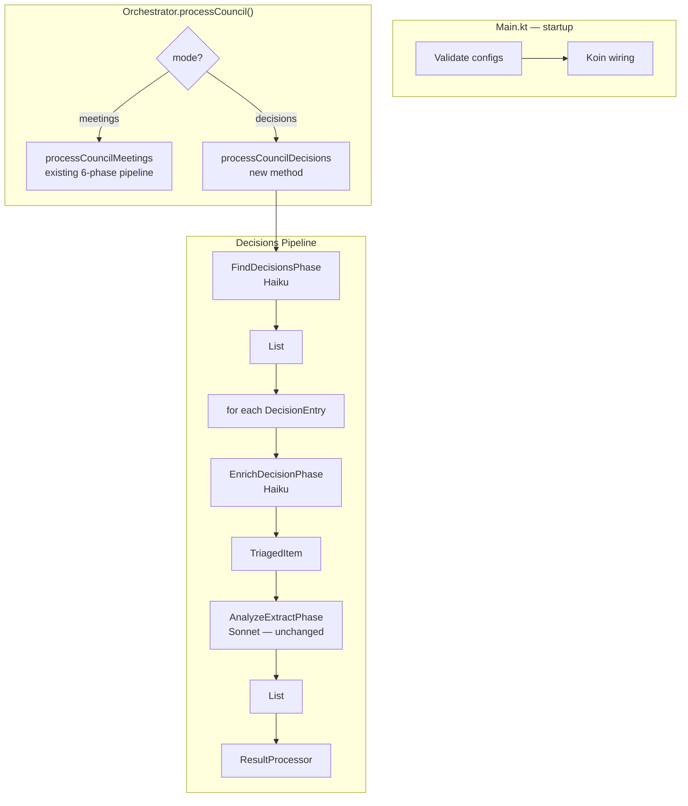

# Design: Decisions Page Pipeline

## Overview

Add a `decisions` pipeline mode to `Orchestrator` that scrapes ModernGov delegated-decision registers (`mgDelegatedDecisions.aspx`) instead of navigating committee meetings. Two new phases (`FindDecisionsPhase`, `EnrichDecisionPhase`) plus two new `LlmResponse` variants are added; the existing `AnalyzeExtractPhase` (Phase 6) is reused unchanged. The existing meetings pipeline is untouched.

---

## Architecture



---

## Data Class Changes

### `CouncilConfig` (modify `config/AppConfig.kt`)

```kotlin
@Serializable
data class CouncilConfig(
    val name: String,
    val meetingsUrl: String? = null,            // renamed from siteUrl; nullable; required for meetings mode
    val committees: List<String> = emptyList(),
    val mode: String = "meetings",              // "meetings" | "decisions"
    val decisionsUrl: String? = null,           // required when mode == "decisions"
    val decisionMakers: List<String> = emptyList(), // required when mode == "decisions"
    val dateFrom: String? = null,
    val dateTo: String? = null,
)
```

**Breaking change:** `siteUrl` is renamed to `meetingsUrl`. Existing YAML config files must rename the key. Startup validation (see below) catches missing `meetingsUrl` for meetings-mode councils.

> **Serialization note:** kotlinx.serialization with kaml derives the YAML key name directly from the Kotlin field name. Renaming the field from `siteUrl` to `meetingsUrl` changes the expected YAML key from `siteUrl:` to `meetingsUrl:`. No `@SerialName("siteUrl")` alias is added — backward compatibility is not preserved, and migration is required. Any existing `config.yaml` that uses `siteUrl:` must rename that key to `meetingsUrl:` before the updated binary is run.

### `DecisionEntry` (new, in `orchestrator/LlmResponse.kt`)

```kotlin
@Serializable
data class DecisionEntry(
    val title: String,
    val decisionDate: String,          // YYYY-MM-DD
    val detailUrl: String,
    val decisionMaker: String? = null, // populated if visible in listing table; may be null
)
```

No other data classes are added or modified. `Scheme` is not changed (AC-5.4).

---

## New `LlmResponse` Variants

Add the following nested classes inside the `LlmResponse` sealed interface body in `orchestrator/LlmResponse.kt`. All existing variants (`Fetch`, `CommitteePagesFound`, etc.) are nested inside `sealed interface LlmResponse { ... }`; these new variants follow the same pattern:

```kotlin
@Serializable
sealed interface LlmResponse {
    // ... existing variants unchanged ...

    @Serializable
    @SerialName("decisions_page_scanned")
    data class DecisionsPageScanned(
        val decisions: List<DecisionEntry>,
        val nextUrl: String? = null, // "Earlier"/"Later" pagination link; null when done
    ) : LlmResponse

    @Serializable
    @SerialName("decision_fetch")
    data class DecisionFetch(
        val urls: List<String>,
        val extract: TriagedItem? = null, // partial extract accumulated so far; null on first call
        val reason: String,
    ) : LlmResponse

    @Serializable
    @SerialName("decision_enriched")
    data class DecisionEnriched(
        val item: TriagedItem,
        val decisionMaker: String? = null, // extracted from detail page; null if undetermined
    ) : LlmResponse
}
```

### `resolveUrls()` additions

Extend the exhaustive `when` expression in `fun LlmResponse.resolveUrls(...)`:

```kotlin
is LlmResponse.DecisionsPageScanned -> copy(
    decisions = decisions.map { it.copy(detailUrl = resolve(it.detailUrl)) },
    nextUrl = nextUrl?.let { resolve(it) },
)
is LlmResponse.DecisionFetch -> copy(urls = urls.map { resolve(it) })
is LlmResponse.DecisionEnriched -> this
```

---

## Phase `FindDecisionsPhase`

**File:** `src/main/kotlin/orchestrator/phase/FindDecisionsPhase.kt` (create)

### Input data class

```kotlin
data class FindDecisionsInput(
    val decisionsUrl: String,
    val decisionMakers: List<String>,
    val dateFrom: String,
    val dateTo: String,
)
```

### Class signature

```kotlin
class FindDecisionsPhase(
    webScraper: WebScraper,
    llmClient: LlmClient,
    private val lightModel: String = DEFAULT_LIGHT_MODEL,
    private val maxIterations: Int = DEFAULT_D2_MAX_ITERATIONS,
) : BasePhase<FindDecisionsInput, List<DecisionEntry>>(webScraper, llmClient) {

    override val name = "Find decisions"

    override suspend fun doExecute(input: FindDecisionsInput): List<DecisionEntry>?
}
```

### Loop structure

`FindDecisionsPhase` does **not** use `navigationLoop()` — it must accumulate results across multiple listing pages rather than returning on first result. It implements its own loop:

```
accumulated = mutableListOf<DecisionEntry>()
currentUrl = input.decisionsUrl

for (iteration in 1..maxIterations):
    conversionResult = fetchAndExtract(currentUrl)
    if conversionResult == null:
        log warn "Find decisions — fetch failed for $currentUrl"
        break

    prompt = buildFindDecisionsPrompt(input.decisionMakers, input.dateFrom, input.dateTo, conversionResult.text)
    raw = llmClient.generate(prompt.system, prompt.user, lightModel)
    response = parseResponse(raw)?.resolveUrls(conversionResult.urlRegistry::resolve)
    if response == null: return null

    when response:
        is DecisionsPageScanned:
            accumulated += response.decisions
            if response.nextUrl == null: break         // done
            currentUrl = response.nextUrl

        else:
            log warn "Find decisions — unexpected response type: ${response::class.simpleName}"
            return null

// after loop:
if iteration == maxIterations && response had nextUrl:
    log WARN "Find decisions — max iterations ($maxIterations) reached for last page: $currentUrl. Returning ${accumulated.size} decisions found so far."

return accumulated  // empty list is valid; null only on parse/unexpected-type failure
```

**Notes:**
- Returns `emptyList()` (not `null`) when no decisions match — orchestrator logs info and skips.
- Returns `null` only on LLM parse failure or unexpected response type (signals pipeline error, not "no results").

### Constant to add to `Phase.kt`

```kotlin
const val DEFAULT_D2_MAX_ITERATIONS = 50
```

---

## Phase `EnrichDecisionPhase`

**File:** `src/main/kotlin/orchestrator/phase/EnrichDecisionPhase.kt` (create)

### Input data class

```kotlin
data class EnrichDecisionInput(
    val decision: DecisionEntry,
)
```

### Class signature

```kotlin
class EnrichDecisionPhase(
    webScraper: WebScraper,
    llmClient: LlmClient,
    private val lightModel: String = DEFAULT_LIGHT_MODEL,
    private val maxIterations: Int = DEFAULT_TRIAGE_MAX_ITERATIONS, // 5
) : BasePhase<EnrichDecisionInput, DecisionEnriched>(webScraper, llmClient) {

    override val name = "Enrich decision"

    override suspend fun doExecute(input: EnrichDecisionInput): DecisionEnriched?
}
```

`doExecute()` returns `DecisionEnriched?` (not `TriagedItem?`) so that the decision maker extracted from the detail page is surfaced to `processCouncilDecisions()` for AC-3.3/AC-3.4 filtering. `processCouncilDecisions()` unpacks `.item` (the `TriagedItem`) and `.decisionMaker` separately.

### Loop structure

Processes a single `DecisionEntry` through multiple fetch iterations, mirroring `EnrichAgendaItemsPhase`.

```
currentUrl = input.decision.detailUrl
processedUrls = mutableSetOf(currentUrl)
currentExtract: TriagedItem? = null

for (iteration in 1..maxIterations):
    conversionResult = fetchAndExtract(currentUrl)
    if conversionResult == null:
        log warn "Enrich decision — fetch failed for $currentUrl"
        if iteration == 1: return null   // detail page itself failed
        else: break                      // partial; fall through to return null at end

    prompt = buildEnrichDecisionPrompt(input.decision, currentExtract, conversionResult.text)
    raw = llmClient.generate(prompt.system, prompt.user, lightModel)
    response = parseResponse(raw)?.resolveUrls(conversionResult.urlRegistry::resolve)
    if response == null: return null

    when response:
        is DecisionEnriched:
            return response              // done; caller unpacks .item and .decisionMaker

        is DecisionFetch:
            if response.extract != null: currentExtract = response.extract
            newUrls = response.urls.filterNot { it in processedUrls }
            if newUrls.isEmpty(): break
            currentUrl = newUrls.first()
            processedUrls += currentUrl
            log info "Enrich decision — fetching additional document: $currentUrl (${response.reason})"

        else:
            log warn "Enrich decision — unexpected response type: ${response::class.simpleName}"
            return null

log warn "Enrich decision — max iterations ($maxIterations) reached for '${input.decision.title}'"
return null
```

**`releaseDocument()` handling:** FR-13 and AC-4.6 require `releaseDocument()` in a `finally` block for each PDF fetched. This is satisfied by `BasePhase.execute()`'s `finally` block, which calls `webScraper.releaseDocument()` for every URL fetched via `fetchAndExtract()` in its `finally` (see `Phase.kt` lines 36–43: `trackedUrls.forEach { webScraper.releaseDocument(it) }` runs unconditionally after `doExecute()` returns or throws). No additional `finally` block is needed within `doExecute()` — this is identical to the pattern in `EnrichAgendaItemsPhase` (Phase 5).

**AC-3.3/AC-3.4 decision maker deferral:** When the decision maker is not visible in the D2 listing table, `DecisionEntry.decisionMaker` is `null`. D3's prompt includes the `decisionMakers` list in the system part; the LLM extracts the decision maker from the detail page's "Decision Maker" field and returns it in `DecisionEnriched.decisionMaker`. If the detail page reveals that the decision maker does not match any configured entry, the LLM is expected (by prompt instruction) to return an empty/irrelevant extract indicating the decision should be skipped — consistent with AC-3.4. No code-level string-matching filter is applied; LLM judgement is trusted to handle name variations and spelling differences (AC-3.2). `processCouncilDecisions()` uses `enriched.decisionMaker` (falling back to `decision.decisionMaker`, then `council.decisionMakers.first()`) to populate `Scheme.committeeName`.

---

## Orchestrator Changes

### `processCouncil()` dispatch

```kotlin
suspend fun processCouncil(council: CouncilConfig) {
    if (council.mode == "decisions") {
        processCouncilDecisions(council)
    } else {
        processCouncilMeetings(council)
    }
}
```

The existing body of `processCouncil()` is renamed to `private suspend fun processCouncilMeetings(council: CouncilConfig)`. The only internal change: `council.siteUrl` becomes `council.meetingsUrl!!` (non-null assert is safe; startup validation enforces it for meetings mode).

### New `processCouncilDecisions()`

```kotlin
private suspend fun processCouncilDecisions(council: CouncilConfig) {
    val dateFrom = council.dateFrom ?: LocalDate.now().format(DateTimeFormatter.ISO_LOCAL_DATE)
    val dateTo = council.dateTo
        ?: LocalDate.now().plusMonths(3).format(DateTimeFormatter.ISO_LOCAL_DATE)

    // decisionsUrl non-null guaranteed by startup validation
    val decisions = findDecisionsPhase.execute(
        FindDecisionsInput(
            decisionsUrl = council.decisionsUrl!!,
            decisionMakers = council.decisionMakers,
            dateFrom = dateFrom,
            dateTo = dateTo,
        )
    )
    if (decisions == null) {
        logger.warn("Find decisions phase failed for council '{}'", council.name)
        return
    }
    if (decisions.isEmpty()) {
        logger.info("No matching decisions found for council '{}'", council.name)
        return
    }
    logger.info("Found {} matching decision(s) for council '{}'", decisions.size, council.name)

    val allSchemes = mutableListOf<Scheme>()
    for (decision in decisions) {
        logger.info("Enriching decision '{}' ({})", decision.title, decision.detailUrl)

        val enriched = enrichDecisionPhase.execute(EnrichDecisionInput(decision))
        if (enriched == null) {
            logger.warn("Enrich decision phase failed for '{}', skipping", decision.title)
            continue
        }

        val triaged = enriched.item
        val extract = "## ${triaged.title}\n${triaged.extract}"
        val decisionMakerLabel = enriched.decisionMaker
            ?: decision.decisionMaker
            ?: council.decisionMakers.firstOrNull()
            ?: council.name
        val syntheticMeeting = Meeting(
            date = decision.decisionDate,
            title = decision.title,
            meetingUrl = decision.detailUrl,
        )

        val schemes = analyzeExtractPhase.execute(
            AnalyzeExtractInput(extract, decisionMakerLabel, syntheticMeeting)
        )
        if (schemes != null) {
            allSchemes.addAll(schemes)
        }
    }

    val outputLabel = council.decisionMakers.joinToString(", ")
    resultProcessor.process(council.name, outputLabel, allSchemes)
}
```

**Scheme field mapping (AC-5.1–5.3):**
- `Scheme.meetingDate` ← `decision.decisionDate` (via `syntheticMeeting.date`)
- `Scheme.committeeName` ← `decisionMakerLabel` (via `AnalyzeExtractInput.committeeName`)
- `Scheme.agendaUrl` ← `decision.detailUrl` (via `syntheticMeeting.meetingUrl`)

`AnalyzeExtractPhase.doExecute()` applies this mapping with no changes to that class.

### Updated `Orchestrator` constructor

```kotlin
class Orchestrator(
    private val findCommitteePagesPhase: FindCommitteePagesPhase,
    private val findMeetingsPhase: FindMeetingsPhase,
    private val findAgendaPhase: FindAgendaPhase,
    private val identifyAgendaItemsPhase: IdentifyAgendaItemsPhase,
    private val enrichAgendaItemsPhase: EnrichAgendaItemsPhase,
    private val analyzeExtractPhase: AnalyzeExtractPhase,
    private val findDecisionsPhase: FindDecisionsPhase,       // new
    private val enrichDecisionPhase: EnrichDecisionPhase,     // new
    private val resultProcessor: ResultProcessor,
)
```

---

## Prompts.kt Additions

### `buildFindDecisionsPrompt()`

```kotlin
fun buildFindDecisionsPrompt(
    decisionMakers: List<String>,
    dateFrom: String,
    dateTo: String,
    pageContent: String,
): SplitPrompt
```

**System part** — static, identical for all `FindDecisionsPhase` calls across all councils and iterations:
- Task description: identify delegated decisions from a ModernGov decision listing page
- Topics filter: `TOPICS_STRING` and `EXCLUDED_TOPICS_STRING` (app-wide constants)
- Decision maker matching rules: case-insensitive substring match against the `decisionMakers` list provided in the user prompt
- Date range filtering rules: only include decisions within the date range provided in the user prompt
- "Earlier"/"Later" navigation: if more date windows remain within the range, set `nextUrl`; otherwise omit or set to null
- JSON schema for `decisions_page_scanned`

**User part** — dynamic (per council, per iteration):
```
Decision makers (include only these, case-insensitive substring match):
- <decisionMakers[0]>
- <decisionMakers[1]>
...

Date range: <dateFrom> to <dateTo>

<pageContent>
```

**JSON schema in system prompt:**
```json
{
  "type": "decisions_page_scanned",
  "decisions": [
    {
      "title": "Decision title",
      "decisionDate": "YYYY-MM-DD",
      "detailUrl": "@1",
      "decisionMaker": "Name/role if visible, otherwise omit"
    }
  ],
  "nextUrl": "@2"
}
```

`nextUrl` is null/omitted when no further pagination is needed within the date range.

### `buildEnrichDecisionPrompt()`

```kotlin
fun buildEnrichDecisionPrompt(
    decision: DecisionEntry,
    currentExtract: TriagedItem?,
    pageContent: String,
): SplitPrompt
```

**System part** — static, identical for all `EnrichDecisionPhase` calls:
- Task description: extract full decision detail from a ModernGov decision detail page and its linked documents
- Topics filter: `TOPICS_STRING` and `EXCLUDED_TOPICS_STRING`
- Fields to extract: decision title, decision maker name/role, decision date, full decision body text, consultation outcomes, conditions, vote counts
- Instruction: always extract and return the decision maker name/role exactly as found in the "Decision Maker" field on the detail page; include it as `decisionMaker` in the `decision_enriched` response (AC-3.3)
- Document skipping rule: skip linked documents whose title/filename contains "drawing", "plan", "map", "layout", "elevation", "figure" or similar non-textual terms
- Two response types and their JSON schemas

**User part** — dynamic (per decision, per iteration):
```
Decision title: <decision.title>
Detail page URL: <decision.detailUrl>
${if currentExtract != null: "Extract accumulated so far:\n<currentExtract.extract>\n\n---\n\n"}
<pageContent>
```

**JSON schemas in system prompt:**
```json
// When more documents needed:
{
  "type": "decision_fetch",
  "urls": ["@1"],
  "extract": {"title": "...", "extract": "accumulated text so far"},
  "reason": "Why this document is needed"
}

// When enrichment complete:
{
  "type": "decision_enriched",
  "item": {"title": "Decision title", "extract": "Full enriched extract..."},
  "decisionMaker": "Name/role from 'Decision Maker' field, or omit if not found"
}
```

---

## Startup Validation

**Location:** `Main.kt`, immediately after `loadConfig()` returns `appConfig`, before Koin is started.

```kotlin
val validationErrors = appConfig.councils.flatMap { council ->
    buildList {
        if (council.mode == "decisions") {
            if (council.decisionsUrl.isNullOrBlank()) {
                add("Council '${council.name}': mode=decisions but decisionsUrl is missing or blank")
            }
            if (council.decisionMakers.isEmpty()) {
                add("Council '${council.name}': mode=decisions but decisionMakers is empty")
            }
        } else {
            if (council.meetingsUrl.isNullOrBlank()) {
                add("Council '${council.name}': mode=meetings but meetingsUrl is missing or blank")
            }
        }
    }
}
if (validationErrors.isNotEmpty()) {
    validationErrors.forEach { logger.error(it) }
    return
}
```

---

## Koin Wiring

In `Main.kt`, `orchestratorModule`:

```kotlin
single { FindDecisionsPhase(get(), get()) }
single { EnrichDecisionPhase(get(), get()) }
single {
    Orchestrator(get(), get(), get(), get(), get(), get(), get(), get(), get())
    // order: findCommitteePages, findMeetings, findAgenda, identifyAgendaItems,
    //        enrichAgendaItems, analyzeExtract, findDecisions, enrichDecision, resultProcessor
}
```

---

## Config Schema

```yaml
councils:
  # Decisions-mode council (new)
  - name: Westminster
    mode: decisions
    decisionsUrl: https://westminster.moderngov.co.uk/mgDelegatedDecisions.aspx?bcr=1&DM=0&DS=2&K=0&V=0
    decisionMakers:
      - Cabinet Member for Streets
    dateFrom: "2025-01-01"
    dateTo: "2025-12-31"

  # Meetings-mode council (renamed siteUrl → meetingsUrl)
  - name: Barnet
    meetingsUrl: https://barnet.moderngov.co.uk
    committees:
      - Planning Committee
      - Transport Committee
    dateFrom: "2025-01-01"
    dateTo: "2025-12-31"

outputDir: output/
debugLlmDir: debug/
```

### `CouncilConfig` field table

| Field | Type | Default | Meetings mode | Decisions mode |
|-------|------|---------|---------------|----------------|
| `name` | `String` | — | Required | Required |
| `meetingsUrl` | `String?` | `null` | Required | Ignored |
| `committees` | `List<String>` | `[]` | Required | Ignored |
| `mode` | `String` | `"meetings"` | Optional | Must be `"decisions"` |
| `decisionsUrl` | `String?` | `null` | Ignored | Required |
| `decisionMakers` | `List<String>` | `[]` | Ignored | Required (min 1) |
| `dateFrom` | `String?` | `null` | Optional | Optional |
| `dateTo` | `String?` | `null` | Optional | Optional |

### Config Migration

`siteUrl` → `meetingsUrl` is a **breaking YAML key rename**. kaml serializes the Kotlin field name directly; no `@SerialName` alias is provided. All existing config files must rename `siteUrl:` to `meetingsUrl:` before running the updated binary. No backward-compatible `siteUrl:` key will be accepted after this change.

---

## File Structure

| File | Action | Change |
|------|--------|--------|
| `src/main/kotlin/config/AppConfig.kt` | Modify | Rename `siteUrl` → `meetingsUrl` (nullable); add `mode`, `decisionsUrl`, `decisionMakers` fields |
| `src/main/kotlin/orchestrator/LlmResponse.kt` | Modify | Add `DecisionEntry` data class; add `DecisionsPageScanned`, `DecisionFetch`, `DecisionEnriched` variants; extend `resolveUrls()` |
| `src/main/kotlin/orchestrator/phase/Phase.kt` | Modify | Add `DEFAULT_D2_MAX_ITERATIONS = 50` constant |
| `src/main/kotlin/orchestrator/Prompts.kt` | Modify | Add `buildFindDecisionsPrompt()` and `buildEnrichDecisionPrompt()` |
| `src/main/kotlin/orchestrator/phase/FindDecisionsPhase.kt` | Create | `FindDecisionsPhase` — enumerate decision listings with accumulation loop |
| `src/main/kotlin/orchestrator/phase/EnrichDecisionPhase.kt` | Create | `EnrichDecisionPhase` — enrich single decision via fetch loop |
| `src/main/kotlin/orchestrator/Orchestrator.kt` | Modify | Add `findDecisionsPhase`/`enrichDecisionPhase` constructor params; rename existing body to `processCouncilMeetings()`; add `processCouncilDecisions()`; add dispatch |
| `src/main/kotlin/Main.kt` | Modify | Add startup validation; register two new phase singletons; update `Orchestrator(...)` call |
| `src/test/kotlin/orchestrator/FindDecisionsPhaseTest.kt` | Create | Unit tests for `FindDecisionsPhase` |
| `src/test/kotlin/orchestrator/EnrichDecisionPhaseTest.kt` | Create | Unit tests for `EnrichDecisionPhase` |
| `src/test/kotlin/orchestrator/OrchestratorDecisionsTest.kt` | Create | Orchestrator dispatch + decisions pipeline integration tests |

---

## Technical Decisions

| Decision | Options Considered | Choice | Rationale |
|----------|-------------------|--------|-----------|
| `siteUrl` rename | Keep as-is / rename to `meetingsUrl` | Rename to `meetingsUrl` | Symmetry with `decisionsUrl`; makes mode-specific field intent clear |
| System prompt content | Include per-council data (decisionMakers) / keep static | Static system prompt; per-council data in user part | System prompt must be identical across all calls to maximise prompt cache hit rate across councils and iterations |
| `FindDecisionsPhase` loop | Reuse `navigationLoop()` / own accumulation loop | Own loop | `navigationLoop()` returns on first result; `FindDecisionsPhase` must accumulate across all pages before returning |
| `EnrichDecisionPhase` response variants | Two variants (`fetch`/`enriched`) / single finalisation variant | Two variants | Mirrors `EnrichAgendaItemsPhase` pattern; LLM carries partial extract forward in `DecisionFetch.extract` |
| `releaseDocument()` in `EnrichDecisionPhase` | Explicit `finally` / rely on `BasePhase.execute()` | Rely on `BasePhase.execute()` | `BasePhase` already tracks and releases all URLs from `fetchAndExtract()` in its `finally` block |
| Scheme field population | Apply in `processCouncilDecisions()` / pass via synthetic `Meeting` to `AnalyzeExtractPhase` | Synthetic `Meeting` | `AnalyzeExtractPhase` already reads `meeting.date`, `committeeName`, `meeting.meetingUrl` to populate Scheme — zero changes to that phase |
| Orchestrator structure | Single method with conditional / separate private methods | Separate private methods | Keeps concerns isolated; meetings pipeline code is unchanged |
| `DEFAULT_D2_MAX_ITERATIONS` placement | Per-council config field / code constant in `Phase.kt` | Code constant (`DEFAULT_D2_MAX_ITERATIONS = 50` in `Phase.kt`) | AC-2.3 and NFR-2 explicitly state this is a code constant, not a per-council config field. No `d2MaxIterations` config key exists. |

---

## Test Strategy

### `FindDecisionsPhaseTest` (new file)

Uses `MockLlmClient` + Ktor `MockEngine` (same pattern as `OrchestratorTest`).

| Test | Verifies |
|------|----------|
| `returns empty list when no decisions match` | `DecisionsPageScanned(decisions=[], nextUrl=null)` → `emptyList()` |
| `returns decisions from single page` | Single page, 2 matching decisions, `nextUrl=null` → list of 2 |
| `accumulates decisions across multiple pages` | Page 1: 2 decisions + `nextUrl`; page 2: 1 decision + null → 3 total |
| `stops at max iterations and returns partial results` | `maxIterations=2`; LLM always returns `nextUrl` → 2 pages processed, partial list returned |
| `returns null on unexpected response type` | LLM returns `{"type":"fetch",...}` → null |
| `returns null on LLM parse failure` | LLM returns malformed JSON → null |

### `EnrichDecisionPhaseTest` (new file)

| Test | Verifies |
|------|----------|
| `returns DecisionEnriched with item and decisionMaker on immediate decision_enriched response` | LLM returns `decision_enriched` on first call; `.item` and `.decisionMaker` populated |
| `fetches additional document and returns enriched on second call` | First: `decision_fetch`; second: `decision_enriched` |
| `carries partial extract forward into next fetch prompt` | `DecisionFetch.extract` present; user prompt for second call contains it |
| `returns null when detail page fetch fails on first iteration` | `MockEngine` returns 404 for detail URL → null |
| `returns null when max iterations reached without decision_enriched` | `maxIterations=2`; LLM always returns `decision_fetch` → null |
| `returns null on unexpected response type` | LLM returns `{"type":"agenda_analyzed",...}` → null |

### `OrchestratorDecisionsTest` (new file — does not modify `OrchestratorTest`)

| Test | Verifies |
|------|----------|
| `dispatches to decisions pipeline for mode=decisions` | `findDecisionsPhase` called; meetings phases not called |
| `dispatches to meetings pipeline for mode=meetings` | Existing meetings phase called; decisions phases not called |
| `dispatches to meetings pipeline when mode field absent` | Default `"meetings"` → meetings pipeline |
| `decisions pipeline produces schemes with correct field mapping` | `Scheme.meetingDate`, `.committeeName`, `.agendaUrl` populated correctly |
| `decisions pipeline uses decisionMaker from DecisionEnriched for committeeName` | `enriched.decisionMaker` is non-null → used as `committeeName`; falls back to `decision.decisionMaker` when null |
| `decisions pipeline skips decisions where enrich phase returns null` | EnrichDecision mock returns null for one decision; others processed |
| `decisions pipeline logs info and skips when find phase returns empty list` | Empty list from `FindDecisionsPhase` → info log, no processor call |

### Regression

`OrchestratorTest` requires two mechanical changes (permitted by AC-6.1): (1) rename `siteUrl` to `meetingsUrl` in any `CouncilConfig(...)` constructor call; (2) update any `Orchestrator(...)` construction call to supply mock/stub instances for the two new constructor params (`findDecisionsPhase`, `enrichDecisionPhase`) — these have no defaults, so omitting them is a compile error. All other fields have defaults. `./gradlew test` must pass with zero failures.

---

## Edge Cases

- **`decisionMaker` resolution for `committeeName`**: `processCouncilDecisions()` resolves `committeeName` in priority order: `enriched.decisionMaker` (from D3 detail page) → `decision.decisionMaker` (from D2 listing if visible) → `council.decisionMakers.first()` → `council.name`.
- **D3 detail page is a PDF**: `WebScraper.fetchAndExtract()` handles PDFs transparently; no special handling in `EnrichDecisionPhase`.
- **`nextUrl` on last date window**: Listing page may show an "Earlier" link that leads outside `dateFrom`; the LLM must return `nextUrl=null` to stop. Prompt must clearly instruct this.
- **Mixed-mode config**: `processCouncil()` dispatch is purely on `council.mode`; both modes run sequentially in the same `runBlocking` loop.
- **`resultProcessor.process()` with empty schemes**: Called regardless so output files are created (consistent with meetings pipeline behaviour).

---

## Implementation Steps

1. Add `DEFAULT_D2_MAX_ITERATIONS = 50` to `Phase.kt`
2. Modify `AppConfig.kt`: rename `siteUrl` → `meetingsUrl` (nullable), add `mode`, `decisionsUrl`, `decisionMakers`
3. Add `DecisionEntry` and three new `LlmResponse` variants to `LlmResponse.kt`; extend `resolveUrls()` exhaustive `when`
4. Add `buildFindDecisionsPrompt()` and `buildEnrichDecisionPrompt()` to `Prompts.kt`
5. Create `FindDecisionsPhase.kt` with accumulation loop
6. Create `EnrichDecisionPhase.kt` with fetch loop
7. Modify `Orchestrator.kt`: rename existing body to `processCouncilMeetings()`; add two new constructor params; add `processCouncil()` dispatch; implement `processCouncilDecisions()`
8. Modify `Main.kt`: add startup validation; register `FindDecisionsPhase` and `EnrichDecisionPhase` singletons; update `Orchestrator(...)` call
9. Update `OrchestratorTest.kt`: (a) rename `siteUrl` to `meetingsUrl` in `CouncilConfig` constructor calls; (b) add mock/stub instances for `findDecisionsPhase` and `enrichDecisionPhase` to any `Orchestrator(...)` construction calls (new required constructor params)
10. Write `FindDecisionsPhaseTest`, `EnrichDecisionPhaseTest`, `OrchestratorDecisionsTest`
11. Run `./gradlew test` — all tests must pass
